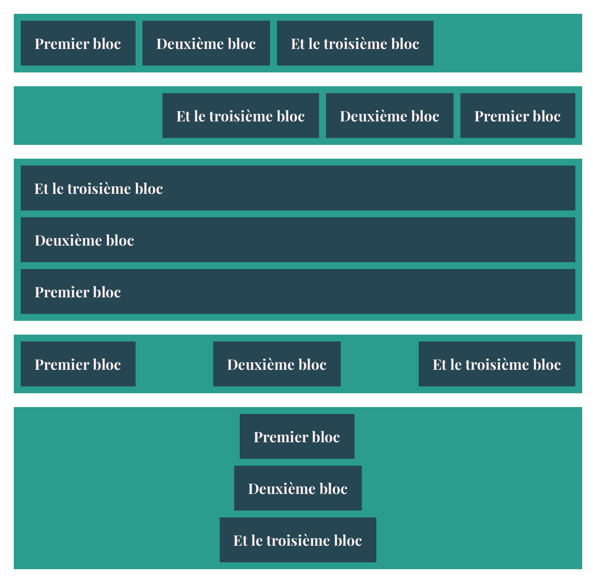

# Exercice Flexbox 1

Intégrez la maquette, **sans modifier le HTML**.

Les éléments nécessaires à l'intégration se trouvent dans le dossier **\_consigne**.

Utilisez la **maquette Sketch** pour récupérer les bonnes informations (par exemple typographie et marges).

## Variables CSS

☝️ Des variables CSS sont disponibles pour les couleurs dans main.css:

```css
:root {
  --dark-blue: #264653;
  --green: #2a9d8f;
  --white: #ffefef;
}
```

Pour les utiliser, consultez la documentation sur les variables CSS.

## Sélecteurs CSS

☝️ Les sections ont deux classes, par exemple:

```html
<div class="section section-3"></div>
```

Utilisez le sélecteur _.section_ pour les propriétés qui se répètent dans toutes les section, et le sélecteur _.section-3_ pour les propriétés spécifiques à la section.

## Aperçu


